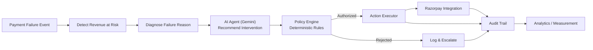
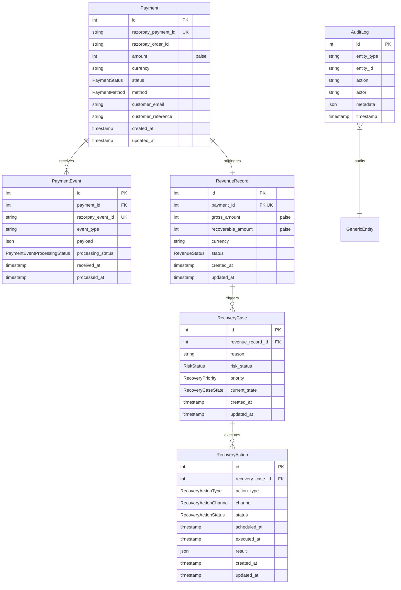

# RecoverAI — Architecture (Day 2 Snapshot)

This document describes the architecture **as planned and built**. Day 1 established
the foundation, and Day 2 implemented the core PostgreSQL/SQLAlchemy 2.x data model
and Alembic migration infrastructure. Items marked *(future)* are not implemented yet.

## High-level flow (target end state)

## Database Schema & Domain Flow (Day 2)

## Core architecture rules

1. **AI never directly controls money.** The AI agent layer (`app/agents`)
   only ever produces a *recommendation*. Every recommendation must pass
   through the policy engine (`app/policies`) before any action reaches
   the Action Executor. *(agents/policies/executor are future work)*
2. **Razorpay integration is isolated** in `app/integrations/razorpay`.
   No other module is allowed to call the Razorpay API directly.
3. **AI logic is isolated** in `app/agents`, separate from routes, models,
   business rules, and payment execution.
4. **Database access is separated** via `app/db` (engine/session/Base) and
   `app/models` (ORM models). No raw SQL scattered across route files.
5. **Configuration is environment-driven.** `app/core/config.py` is the
   only place that reads environment variables; no secrets are
   hard-coded anywhere in the codebase.
6. **Financial Precision:** All monetary amounts are stored in integer paise
   (e.g., 50000 = ₹500.00) to eliminate floating-point rounding errors.

## Day 2 component map

| Layer | Location | Status |
|---|---|---|
| API routes | `backend/app/api/routes/` | `health.py`, `status.py` implemented |
| Config | `backend/app/core/config.py` | Implemented |
| DB engine/session | `backend/app/db/` | Implemented (`session.py`, `base.py`, `init_db.py`) |
| Models | `backend/app/models/` | Implemented (`enums.py`, `mixins.py`, `payment.py`, `revenue.py`, `recovery.py`, `audit.py`, `system.py`) |
| Migrations | `backend/alembic/` | Implemented (`0001_initial_system_health.py`, `0002_payment_recovery_schema.py`) |
| Schemas | `backend/app/schemas/` | `health.py` implemented (domain schemas scheduled next) |
| Services | `backend/app/services/` | Empty — future |
| Agents (AI) | `backend/app/agents/` | Empty — future |
| Policies | `backend/app/policies/` | Empty — future |
| Razorpay integration | `backend/app/integrations/razorpay/` | Empty — future |
| Webhooks | `backend/app/webhooks/` | Empty — future |
| Frontend dashboard shell | `frontend/src/` | Implemented (placeholder data) |

