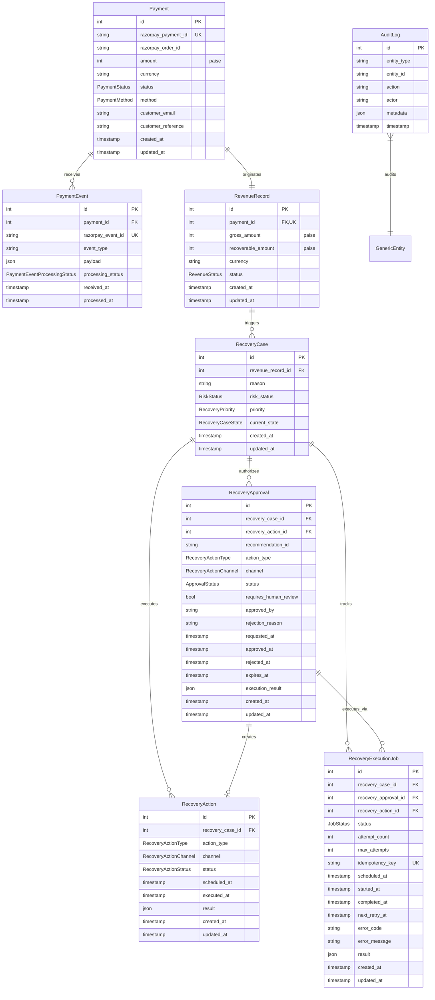

# RecoverAI — Architecture (Day 12 Snapshot)

This document describes the architecture **as planned and built**. Day 1 established
the foundation, Day 2 implemented the core data model and Alembic migrations, Day 3
implemented the application service layer and REST API endpoints, Day 4 implemented
the Razorpay integration and idempotent webhook ingestion pipeline, Day 5 implemented
the advisory AI Recovery Decision Engine & Policy Engine, Day 6 implemented
the controlled Recovery Approval layer and Execution Engine (`MockRecoveryExecutor`),
Day 7 implemented the application-level **Recovery Orchestrator**, Day 8
implemented the **Asynchronous Execution & Multi-Channel Provider Dispatch Layer**,
Day 9 implemented the **Recovery Analytics Engine & Interactive Frontend Dashboard**,
Day 10 implemented the **Synthetic Recovery Dataset Generator, End-to-End Demo Scenarios,
Production Hardening & Presentation Readiness**, and Day 12 implemented
**Merchant Configurable Recovery Policy Rules** with risk approval toggles,
DB-driven orchestration, and interactive policy preview.

## High-level flow (target end state)

```mermaid
flowchart LR
    A[Payment Failure Event] --> B[Detect Revenue at Risk]
    B --> C[Diagnose Failure Reason]
    C --> D["Recovery Orchestrator\nEnd-to-End Coordination"]
    D --> E["AI Decision Engine (Advisory)\nRecommend Intervention"]
    E --> F[Policy Engine\nDeterministic Rules]
    F --> G[Recovery Approval Request\nHuman / System Gate]
    G -->|Authorized| H[Job Creation & Queue\nIdempotency & Retries]
    G -->|Rejected| I[Log & Escalate]
    H --> J[Worker & Provider Registry]
    J --> K[Channel Provider Adapters\nEmail / SMS / WhatsApp / Webhook]
    K --> L[Action & Case Sync]
    L --> M[Audit Trail]
    I --> M
    M --> N["Analytics Engine (Read-Only)\nOverview / Revenue / Timelines"]
    N --> O[Interactive Frontend Dashboard]
```



## Layered Architecture (Day 10)

```mermaid
flowchart TD
    Client[Client / Checkout / Razorpay Webhooks] -->|HTTP POST / JSON / HMAC Sig| Router[FastAPI Router /api/v1]
    Router -->|Signature & Payload Validation| WebhookService[WebhookService / RazorpayService]
    WebhookService -->|Idempotency Check| PaymentEventDB[(PaymentEvent Unique razorpay_event_id)]
    WebhookService -->|State Synchronization| Domain[Payment & Revenue Models]
    Router -->|Orchestrate Workflow| Orchestrator[RecoveryOrchestrator]
    Orchestrator -->|1. Generate Recommendation| AIDecisionEngine[RecoveryDecisionEngine]
    AIDecisionEngine -->|Pre & Post Policy Checks| PolicyEngine[Deterministic Policy Engine]
    Orchestrator -->|2. Create & Track Approval| ApprovalService[ApprovalService / RecoveryApproval]
    Router -->|3. Execute Approval| JobService[JobService / RecoveryExecutionJob]
    JobService -->|4. Enqueue Job| JobQueue[JobQueue / InMemoryJobQueue]
    JobWorker[JobWorker] -->|5. Dequeue & Process| JobService
    JobService -->|6. Resolve Provider| ProviderRegistry[ProviderRegistry]
    ProviderRegistry -->|7. Multi-Channel Dispatch| Providers[Email / SMS / WhatsApp / Webhook Providers]
    JobService -->|8. Record Action Result| RecoveryActionDB[(RecoveryAction)]
    JobService -->|9. State Machine Sync| RecoveryService[RecoveryService]
    JobService -->|10. Audit Events| Audit[AuditService]
    Domain -->|ORM Transactions| DB[(PostgreSQL / SQLite)]
    Audit -->|Audit Trail| DB
    Router -->|11. Analytics Inquiries| AnalyticsService[AnalyticsService (Read-Only)]
    AnalyticsService -->|SQL Aggregations| DB
    Router -->|12. Demo Seeding & Scenarios| DemoService[DemoService (DEMO_MODE Protected)]
    DemoService -->|Seed / Reset / Run| DB
    Dashboard[React Frontend Dashboard] -->|Fetch Metrics & Timelines| Router
```

## Database Schema & Domain Flow (Day 2 to 10)



## Core architecture rules

1. **AI never directly controls money or execution.** The AI decision layer (`app/ai`)
   only ever produces an *advisory recommendation*. It cannot execute transactions,
   call payment gateways, or mutate payment/case statuses directly.
2. **Demo Mode Environment Protection:** The demo seeding and scenario layer (`app/demo`)
   is strictly protected by `DEMO_MODE=true` and is completely disabled in production mode.
3. **Read-Only Analytics Isolation:** The analytics layer (`app/analytics`) performs zero
   database mutations (`INSERT`, `UPDATE`, `DELETE`) and creates zero audit logs.
4. **Infrastructure vs Domain Separation:** `RecoveryExecutionJob` represents background execution
   infrastructure and retries; `RecoveryApproval` represents authorization; `RecoveryAction` represents
   the business intervention; `RecoveryCase` represents the domain state.
5. **Server-Side Authoritative Approvals:** Every recovery action must be preceded by a
   validated `RecoveryApproval` record. High/critical risk cases strictly require human operator review.
6. **Execution Idempotency:** Deterministic `idempotency_key` ensures duplicate execution
   and job requests return cached results without duplicate communications.
7. **Bounded Retry Safety:** Retryable provider failures use exponential backoff up to `max_attempts = 3`.
   Non-retryable failures terminate immediately without endless retry loops.
8. **State Machine Synchronization:** Action execution transitions `RecoveryCase` through
   formal state machine transitions (`open` → `action_pending` → `recovering`).
9. **Razorpay integration is isolated** in `app/integrations/razorpay`.
   No other module is allowed to call the Razorpay API directly.
10. **Database access is separated** via `app/db` (engine/session/Base),
    `app/models` (ORM models), and `app/services` (service layer). No raw SQL scattered across route files.
11. **Configuration is environment-driven.** `app/core/config.py` is the
    only place that reads environment variables; no secrets are
    hard-coded anywhere in the codebase.
12. **Financial Precision:** All monetary amounts are stored in integer paise
    (e.g., 50000 = ₹500.00) to eliminate floating-point rounding errors.
13. **Cryptographic Signature Verification:** Webhook and payment checkout signatures are validated using HMAC-SHA256 constant-time comparison before trusting request payloads.
15. **Merchant Policy Supremacy:** Deterministic merchant policy always precedes and overrides AI recommendations. All financial values are stored in integer paise. High/critical risk approval requirements are now merchant-configurable via `require_approval_for_high_risk` and `require_approval_for_critical_risk` boolean fields. The orchestrator loads policy from DB as the authoritative source.
16. **Policy Preview (Non-Destructive):** `POST /api/v1/policies/preview` evaluates hypothetical recovery scenarios against the active merchant policy without creating any records. Used by the frontend Policy Settings page for interactive policy testing.

## Day 12 component map

| Layer | Location | Status |
|---|---|---|
| API routes | `backend/app/api/routes/` | `health.py`, `status.py`, `system.py`, `policies.py`, `payments.py`, `revenue.py`, `recovery.py`, `audit.py`, `webhooks.py`, `ai.py`, `approvals.py`, `orchestration.py`, `jobs.py`, `analytics.py`, `demo.py` implemented |
| Router aggregation | `backend/app/api/router.py` | Implemented |
| Config | `backend/app/core/config.py` | Implemented with production-validated fields |
| Metrics Registry | `backend/app/core/metrics.py` | Implemented (thread-safe in-memory counters) |
| Exceptions | `backend/app/core/exceptions.py` | Implemented (`NotFoundError`, `ConflictError`, `BadRequestError`, `InvalidStateTransitionError`) |
| Policy Domain | `backend/app/policy/` | Implemented (`service.py`, `rules.py`, `schemas.py`, `exceptions.py`) |
| Demo Exceptions | `backend/app/demo/exceptions.py` | Implemented (`DemoError`, `DemoModeDisabledError`) |
| Analytics Exceptions | `backend/app/analytics/exceptions.py` | Implemented (`AnalyticsError`, `InvalidDateRangeError`) |
| DB engine/session | `backend/app/db/` | Implemented (`session.py`, `base.py`, `init_db.py`) |
| Models | `backend/app/models/` | Implemented (`enums.py`, `mixins.py`, `payment.py`, `revenue.py`, `recovery.py`, `approval.py`, `job.py`, `policy.py`, `audit.py`, `system.py`) |
| Migrations | `backend/alembic/` | Implemented (`0001_initial_system_health.py`, `0002_payment_recovery_schema.py`, `0003_recovery_approval_schema.py`, `0004_execution_jobs_schema.py`, `0005_merchant_policy_schema.py`, `0006_policy_risk_approval_fields.py`) |
| Schemas | `backend/app/schemas/` | Implemented (`health.py`, `system.py`, `payments.py`, `revenue.py`, `recovery.py`, `audit.py`, `orders.py`, `webhooks.py`) |
| Policy Schemas | `backend/app/policy/schemas.py` | Implemented (`MerchantPolicyBase`, `MerchantPolicyCreate`, `MerchantPolicyUpdate`, `MerchantPolicyResponse`, `PolicyValidationResult`, `PolicyEvaluationResult`, `PolicyPreviewRequest`, `PolicyPreviewResponse`) |
| Analytics Schemas | `backend/app/analytics/schemas.py` | Implemented (`OverviewMetrics`, `RevenueAnalytics`, `ExecutionAnalytics`, `ApprovalAnalytics`, `FailureAnalytics`, `ChannelAnalytics`, `TimelinePoint`, `RecentActivityResponse`) |
| Demo Schemas | `backend/app/demo/schemas.py` | Implemented (`DemoSeedRequest`, `DemoSeedResponse`, `DemoResetResponse`, `DemoScenarioInfo`, `DemoScenarioRunResponse`) |
| AI Schemas | `backend/app/ai/schemas.py` | Implemented (`RecoveryContext`, `RawRecommendation`, `PolicyDecision`, `RecoveryRecommendation`) |
| Demo & Seeding | `backend/app/demo/` | Implemented (`generator.py`, `scenarios.py`, `service.py`, `seed.py`, `exceptions.py`, `schemas.py`) |
| Approval Layer | `backend/app/approval/` | Implemented (`service.py`, `policy.py`, `schemas.py`, `exceptions.py`) |
| Execution Layer | `backend/app/execution/` | Implemented (`service.py`, `executor.py`, `mock_executor.py`, `schemas.py`, `exceptions.py`) |
| Orchestration Layer | `backend/app/orchestration/` | Implemented (`orchestrator.py`, `schemas.py`, `exceptions.py`) |
| Background Jobs | `backend/app/jobs/` | Implemented (`service.py`, `worker.py`, `queue.py`, `schemas.py`, `exceptions.py`) |
| Providers & Validation | `backend/app/providers/` | Implemented (`validation.py`, `registry.py`, `base.py`, `email.py`, `sms.py`, `whatsapp.py`, `webhook.py`, `exceptions.py`) |
| Analytics Layer | `backend/app/analytics/` | Implemented (`service.py`, `queries.py`, `metrics.py`, `schemas.py`, `exceptions.py`) |
| Services | `backend/app/services/` | Implemented (`payment_service.py`, `revenue_service.py`, `recovery_service.py`, `audit_service.py`, `webhook_service.py`) |
| Integrations | `backend/app/integrations/razorpay/` | Implemented (`client.py`, `service.py`, `signature.py`, `exceptions.py`) |
| AI Decision & Policy | `backend/app/ai/` | Implemented (`decision_engine.py`, `policy_engine.py`, `provider.py`, `prompts.py`, `exceptions.py`, `schemas.py`) |
| Frontend Dashboard, Policy & Webhook Console | `frontend/src/pages/` | `DashboardPage.jsx`, `PolicySettingsPage.jsx`, `WebhookConsolePage.jsx` implemented |


