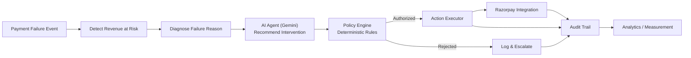
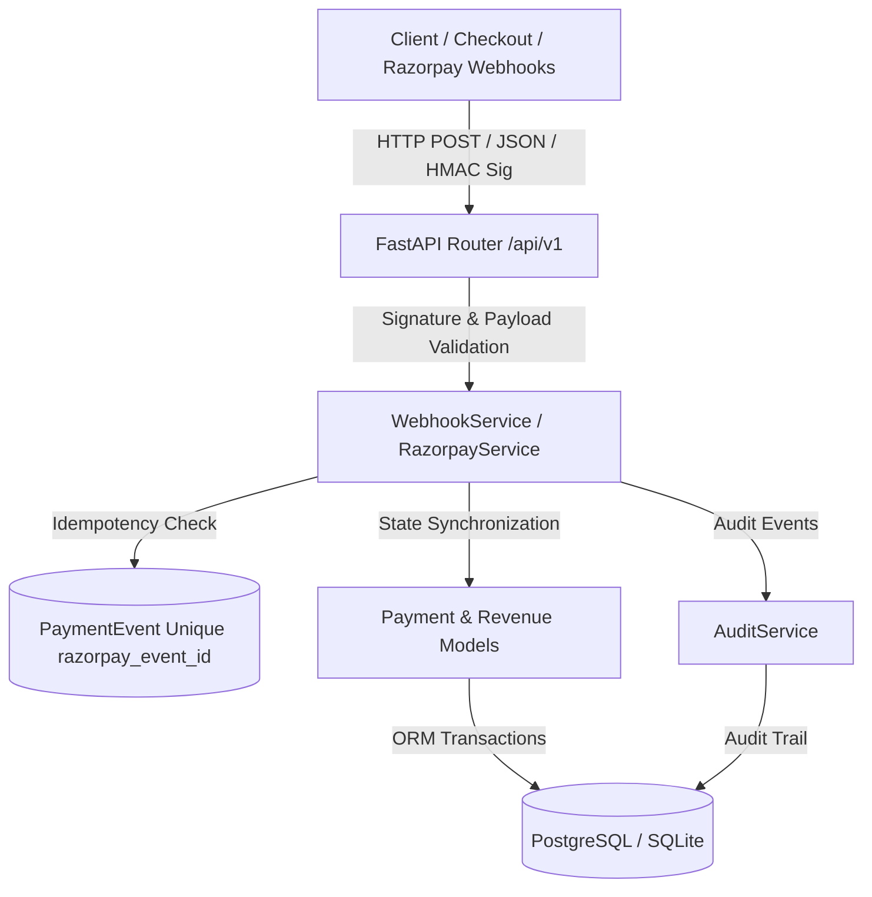
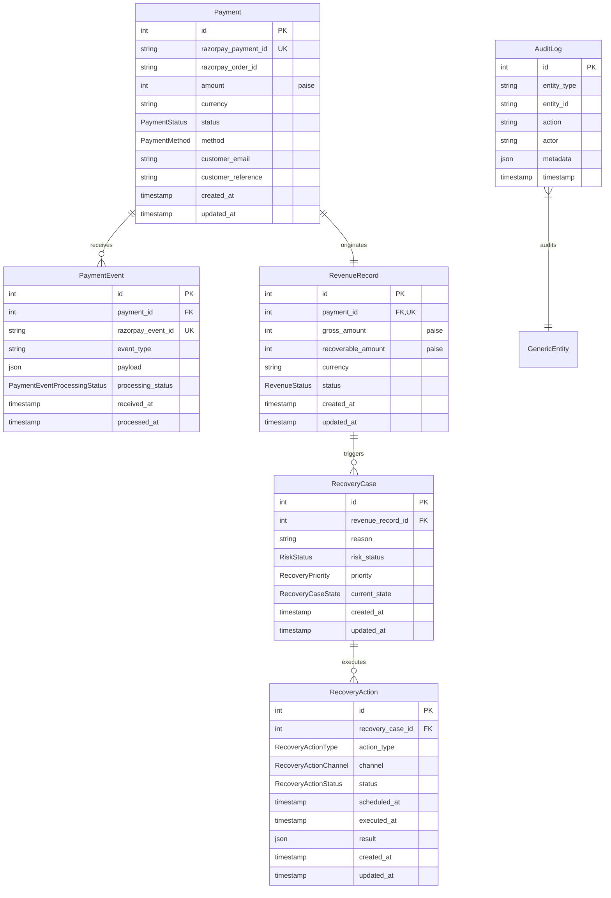

# RecoverAI — Architecture (Day 4 Snapshot)

This document describes the architecture **as planned and built**. Day 1 established
the foundation, Day 2 implemented the core data model and Alembic migrations, Day 3
implemented the application service layer and REST API endpoints, and Day 4 implemented
the isolated Razorpay client/service, HMAC SHA-256 signature verification, and idempotent
webhook ingestion pipeline under `/api/v1/webhooks/razorpay`. Items marked *(future)*
are not implemented yet.

## High-level flow (target end state)

## Layered Architecture (Day 4)

## Database Schema & Domain Flow (Day 2, 3 & 4)

## Core architecture rules

1. **AI never directly controls money.** The AI agent layer (`app/agents`)
   only ever produces a *recommendation*. Every recommendation must pass
   through the policy engine (`app/policies`) before any action reaches
   the Action Executor. *(agents/policies/executor are future work)*
2. **Razorpay integration is isolated** in `app/integrations/razorpay`.
   No other module is allowed to call the Razorpay API directly.
3. **AI logic is isolated** in `app/agents`, separate from routes, models,
   business rules, and payment execution.
4. **Database access is separated** via `app/db` (engine/session/Base),
   `app/models` (ORM models), and `app/services` (service layer). No raw SQL scattered across route files.
5. **Configuration is environment-driven.** `app/core/config.py` is the
   only place that reads environment variables; no secrets are
   hard-coded anywhere in the codebase.
6. **Financial Precision:** All monetary amounts are stored in integer paise
   (e.g., 50000 = ₹500.00) to eliminate floating-point rounding errors.
7. **Deterministic State Transitions:** Case transitions (e.g. `open` → `action_pending` → `recovering` → `recovered` → `closed`)
   are strictly enforced by `RecoveryService` before committing to the database.
8. **Cryptographic Signature Verification:** Webhook and payment checkout signatures are validated using HMAC-SHA256 constant-time comparison before trusting request payloads.
9. **Webhook Idempotency:** Duplicate deliveries of the same Razorpay event ID are safely detected and acknowledged without duplicate side-effects.

## Day 4 component map

| Layer | Location | Status |
|---|---|---|
| API routes | `backend/app/api/routes/` | `health.py`, `status.py`, `payments.py`, `revenue.py`, `recovery.py`, `audit.py`, `webhooks.py` implemented |
| Router aggregation | `backend/app/api/router.py` | Implemented |
| Config | `backend/app/core/config.py` | Implemented |
| Exceptions | `backend/app/core/exceptions.py` | Implemented (`NotFoundError`, `ConflictError`, `BadRequestError`, `InvalidStateTransitionError`) |
| DB engine/session | `backend/app/db/` | Implemented (`session.py`, `base.py`, `init_db.py`) |
| Models | `backend/app/models/` | Implemented (`enums.py`, `mixins.py`, `payment.py`, `revenue.py`, `recovery.py`, `audit.py`, `system.py`) |
| Migrations | `backend/alembic/` | Implemented (`0001_initial_system_health.py`, `0002_payment_recovery_schema.py`) |
| Schemas | `backend/app/schemas/` | Implemented (`health.py`, `payments.py`, `revenue.py`, `recovery.py`, `audit.py`, `orders.py`, `webhooks.py`) |
| Services | `backend/app/services/` | Implemented (`payment_service.py`, `revenue_service.py`, `recovery_service.py`, `audit_service.py`, `webhook_service.py`) |
| Integrations | `backend/app/integrations/razorpay/` | Implemented (`client.py`, `service.py`, `signature.py`, `exceptions.py`) |
| Agents (AI) | `backend/app/agents/` | Empty — future |
| Policies | `backend/app/policies/` | Empty — future |
| Frontend dashboard shell | `frontend/src/` | Implemented (placeholder data) |

