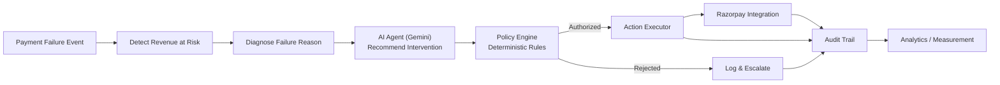

# RecoverAI — Architecture (Day 1 Snapshot)

This document describes the architecture **as planned**. Day 1 only implements
the foundation (app wiring, health check, DB config, dashboard shell). Items
marked *(future)* are not implemented yet.

## High-level flow (target end state)

## Core architecture rules

1. **AI never directly controls money.** The AI agent layer (`app/agents`)
   only ever produces a *recommendation*. Every recommendation must pass
   through the policy engine (`app/policies`) before any action reaches
   the Action Executor. *(agents/policies/executor are future work)*
2. **Razorpay integration is isolated** in `app/integrations/razorpay`.
   No other module is allowed to call the Razorpay API directly.
3. **AI logic is isolated** in `app/agents`, separate from routes, models,
   business rules, and payment execution.
4. **Database access is separated** via `app/db` (engine/session/Base) and
   `app/models` (ORM models). No raw SQL scattered across route files.
5. **Configuration is environment-driven.** `app/core/config.py` is the
   only place that reads environment variables; no secrets are
   hard-coded anywhere in the codebase.

## Day 1 component map

| Layer | Location | Status |
|---|---|---|
| API routes | `backend/app/api/routes/` | `health.py`, `status.py` implemented |
| Config | `backend/app/core/config.py` | Implemented |
| DB engine/session | `backend/app/db/` | Implemented |
| Models | `backend/app/models/system.py` | Minimal health model only |
| Schemas | `backend/app/schemas/health.py` | Implemented |
| Services | `backend/app/services/` | Empty — future |
| Agents (AI) | `backend/app/agents/` | Empty — future |
| Policies | `backend/app/policies/` | Empty — future |
| Razorpay integration | `backend/app/integrations/razorpay/` | Empty — future |
| Webhooks | `backend/app/webhooks/` | Empty — future |
| Frontend dashboard shell | `frontend/src/` | Implemented (placeholder data) |

## Why this structure

Keeping `agents`, `policies`, and `integrations/razorpay` as separate,
currently-empty packages from Day 1 means later milestones can be added
without restructuring the project — reducing risk under the buildathon
deadline.
